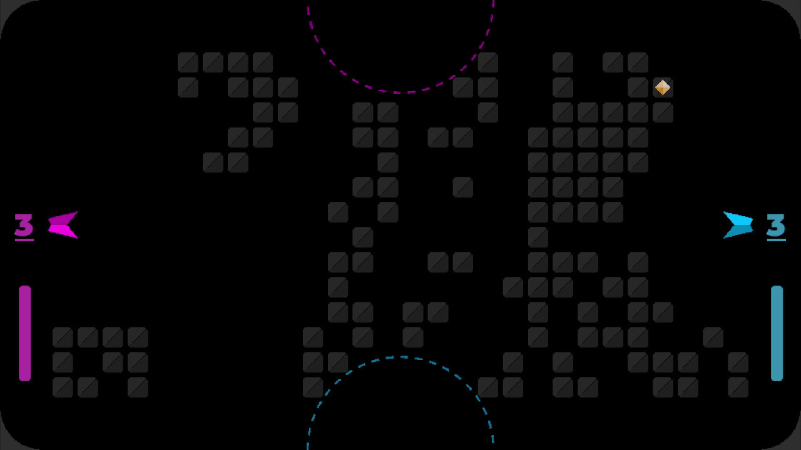
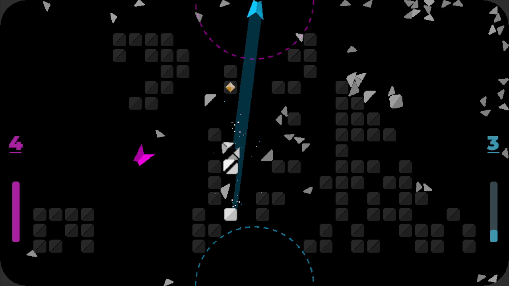
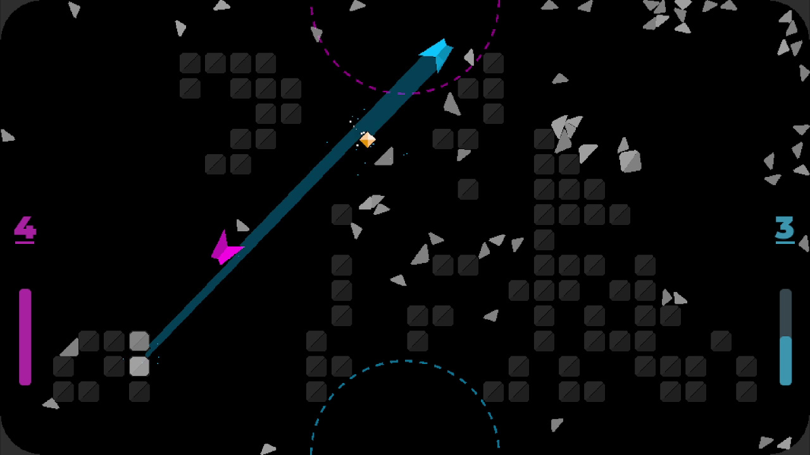

# Blockbusters

**Contestants sabotage each other to mine & capture gems in this unfair arena sport.**

Prototyped at [Noisebridge](https://noisebridge.net) specifically for the [1v1 Coffee Table](https://www.noisebridge.net/wiki/Coffee_Table), playtesting & iterating in the weekly [Gamebridge](https://noisebridge.net/wiki/Gamebridge) meetup.

by [outrightmental](https://discord.com/users/outrightmental)

|  |  |  |
|-------------------------------------------------------------------------------------------------------------------------------------|-------------------------------------------------------------------------------------------------------------------------------------|-------------------------------------------------------------------------------------------------------------------------------------|
|  |  |  |

## Game Design

[Google Drive Folder](https://drive.google.com/drive/folders/1zN-aMi7VjPdOoOUz3s_HHYSwMC-8Zp1V?usp=sharing)

## Continuous Integration

Leverages the GitHub marketplace action [godot-ci](https://github.com/marketplace/actions/godot-ci)

When a tag is pushed to the repository, [this workflow](.github/workflows/distro.yml) will automatically build the
release artifacts and attach them to the tag.

To build & publish a release:

1. [Create a tag](https://git-scm.com/book/en/v2/Git-Basics-Tagging) at the commit you want to release. The tag should
   be the version name you want to give the release, e.g. `v2.1`
2. [Create a release](https://docs.github.com/en/repositories/releasing-projects-on-github/managing-releases-in-a-repository)
   based on the tag

E.g. to build & publish **Release v2.1** we

1. Created the tag `v2.1` and pushed it to the repository -- GitHub Actions then
   automatically [built and published](https://github.com/outrightmental/Blockbusters/actions/runs/16060630082) the
   artifacts and attached them to that tag.
2. Created [release v2.1](https://github.com/outrightmental/Blockbusters/releases/tag/v2.1) from tag `v2.1` -- The
   artifacts then appeared attached to that release
